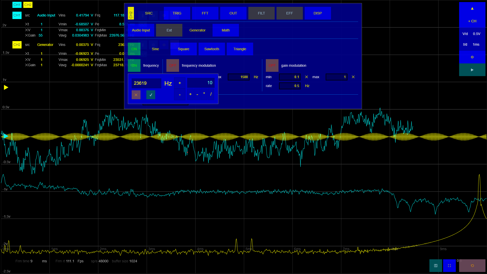
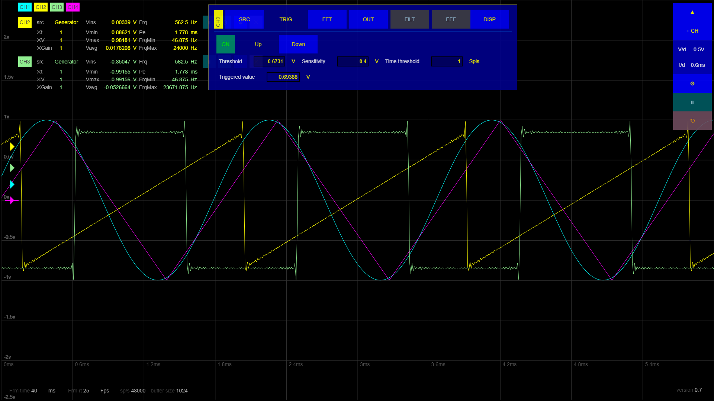
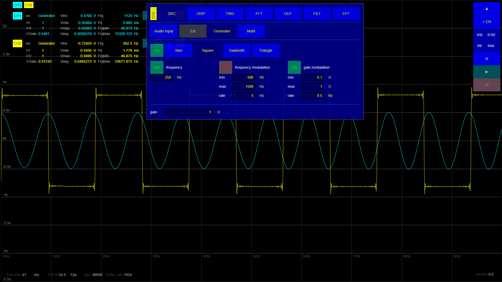
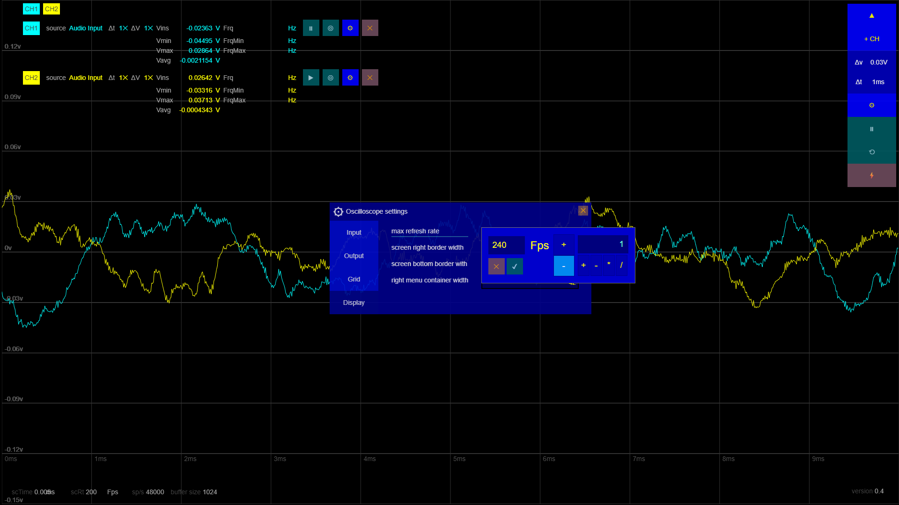
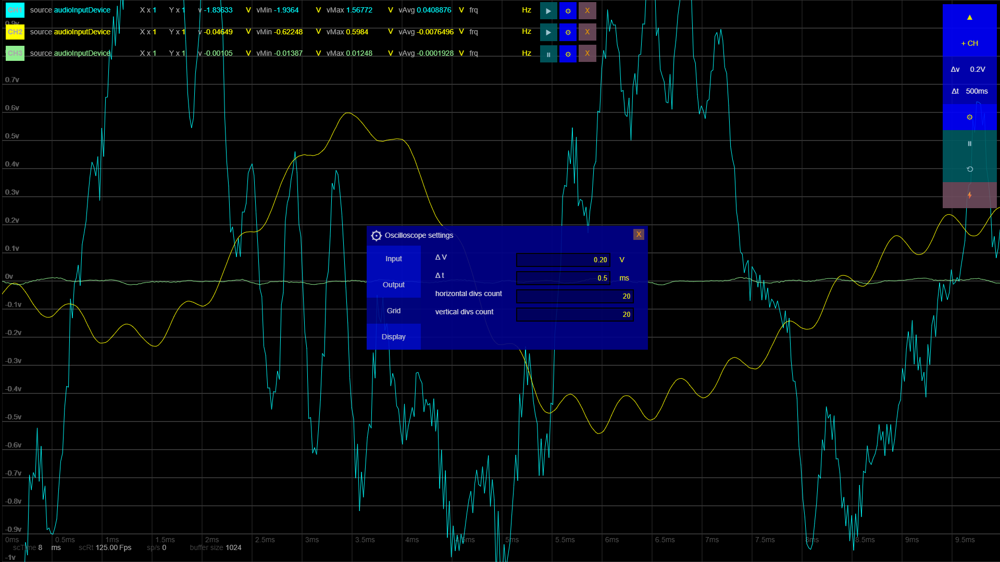

<table>
<tr>
<td>

</td>
<td>
<h1>Sound card Oscilloscope Signal Analyzer Generator</h1>
</td>
</tr>
</table>

A javascript application running an audio sound card oscilloscope,analyzer and generator, in the browser (responsive ui, fits desktop / tablet / smartphone), including:

- oscilloscope
  - time and frequency view
  - trigger
  - cursor/markers,
  - colorisations
  - lissajous 
- signal analyzis 
  - FFT, frequency, min/max/average V/Hz
- signal generator
  - sinus, square, sawtooth
- apply effects on signals 
  - reverb,echo,filter,... 
- maths (combinate signal together) 
- multi channels
- audio channel input
- line out

 

## ⭐ <b>you can run it freely at one of those urls:
- [https://franck-gaspoz.github.io/soundcard-signal-analyzer-generator/](https://franck-gaspoz.github.io/soundcard-signal-analyzer-generator/)
- [https://oscilloscope.infy.uk/](https://oscilloscope.infy.uk/)</b>

## 👉 project status: on going 🟩
___

## Screenshots

*v 0.8 - FFT*

*v 0.7 - triggers with graphical markers*

*v 0.6 - signal generator (oscillator/modulator)*

*v 0.4 - input widget*

*v 0.1 - oscilloscope settings*

___

continuous deployment provided by *GitHub Action* : **FTP Deploy** at [https://github.com/marketplace/actions/ftp-deploy](https://github.com/marketplace/actions/ftp-deploy)

___

## Licence

    Sound card Oscilloscope | Signal Analyser Generator
    Copyright (C) 2025  Franck Gaspoz
    find licence and copyright informations in files /COPYRIGHT and /LICENCE
    contact: franck.gaspoz@gmail.com

    This program is free software; you can redistribute it and/or modify
    it under the terms of the GNU General Public License as published by
    the Free Software Foundation version 2.

    This program is distributed in the hope that it will be useful,
    but WITHOUT ANY WARRANTY; without even the implied warranty of
    MERCHANTABILITY or FITNESS FOR A PARTICULAR PURPOSE.  See the
    GNU General Public License for more details.

    You should have received a copy of the GNU General Public License along
    with this program; if not, write to the Free Software Foundation, Inc.,
    51 Franklin Street, Fifth Floor, Boston, MA 02110-1301 USA.