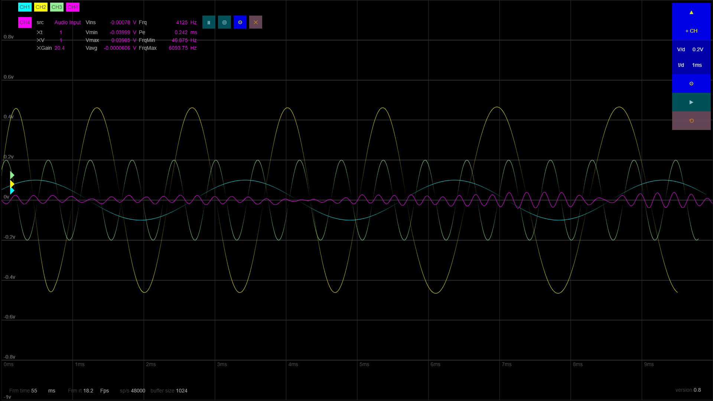

# oscilloscope + signal analyser + generator

A javascript application running in the browser

main purposes:

- oscilloscope (time,frequency,cursor,markers,lissajous,...)
- signal analysis (FFT, frequency, min/max/average, ...)
- signal generator (wave,square,...)
- apply effects on signals (reverb,echo,filter,...)
- maths (combinate signal together)
- multi channels
- audio channel input
- line out

⭐ **run it at: [https://oscilloscope.infy.uk/](https://https://oscilloscope.infy.uk/)** ⭐

continuous deployment provided by *GitHub Action* : **FTP Deploy** at [https://github.com/marketplace/actions/ftp-deploy](https://github.com/marketplace/actions/ftp-deploy)

project status: on going

*v 0.7 - 'temperature' colors*

*v 0.7 - triggers with graphical markers*

*v 0.6 - signal generator (oscillator/modulator)*

*v 0.4 - input widget*

*v 0.1 - oscilloscope settings*
